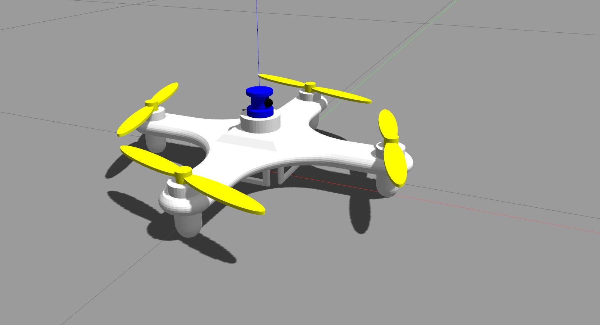
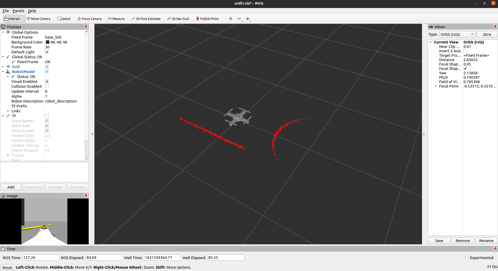

# Anti-Anti-Masker Drone

## Project Members:
1. Shobuj Paul
2. Diptesh Banerjee

## Introduction:
<p>Anti-Anti-Masker is a drone that will roam in crowded city areas and search for people who are not wearing masks and breaking covid protocols. This project can have many other applications, such as security and surveillance.</p>
<p>We have used Fusion360 to design the drone body, rotors and sensor links and then generate its URDF. We have used ROS to design the robot’s physics and simulate the robot. The end plan is to have <em>/cmd_vel</em> topic configured with the robot to pass velocity commands to <em>move_base</em> and use the navigation stack for mapping and motion.</p>  
<p>This drone will have a camera that will have a face recognition system to detect faces without a mask.
<br>
The model will be built over the MobileNet TensorFlow model. MobileNet is used because this model is easily applicable to devices like Rasberry Pi and Arduino. The model will be trained on some real-time images so that it can detect faces and masks properly. The trained model will be exported to OpenCV where it will be used to classify masks in real-time videos.</p>

## Computer Vision

The Dataset used is : 
[With/Without Mask Dataset](https://www.kaggle.com/niharika41298/withwithout-mask)

The model code: [The notebook](drone_vision/Detection_Model.ipynb)

The model structure:
```
input = keras.layers.Input(shape=(224,224,3))
baseModel = MobileNetV2(weights="imagenet", include_top=False, input_shape=(224,224,3), input_tensor= input)

headModel = baseModel.output
headModel = AveragePooling2D(pool_size=(7, 7))(headModel)
headModel = Flatten()(headModel)
headModel = Dense(128, activation="relu")(headModel)
headModel = Dropout(0.5)(headModel)
headModel = Dense(2, activation="softmax")(headModel)
model = Model(inputs=baseModel.input, outputs=headModel)

for layer in baseModel.layers:
	layer.trainable = False
```
Accuracy:  


## Drone 3D Model

Drone Model:
<br>


- The drone was designed in Fusion360 and converted to URDF file format using [fusion2urdf](https://github.com/syuntoku14/fusion2urdf) plugin.
- GPU Laser plugin was used for simulating LIDAR data and camera plugin was used to get raw video feed from the camera link.
- All four rotors show motion. Aerodynamics will be set later.

Drone Sensors:
<br>
 

## Simulation Instructions:

- Clone the repository in the src folder in your workspace.
```bash
cd ~/ros_ws/src/
git clone git@github.com:IEEE-NITK/Anti-Anti-Masker.git drone
```
- Build your workspace.
```bash
cd ~/ros_ws
catkin build
```
- To view the drone model in gazebo environment run:
```bash
roslaunch drone_description gazebo.launch
```
- To open the model in RViz run:
```bash
roslaunch drone_description display.launch
```
