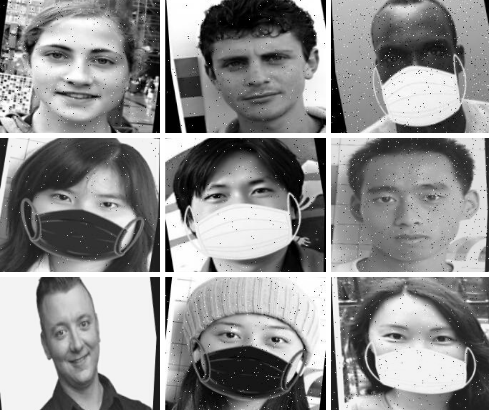

# Anti-Anti-Masker Drone
[](https://github.com/IEEE-NITK/Anti-Anti-Masker/issues)
[](https://github.com/IEEE-NITK/Anti-Anti-Masker/blob/main/LICENSE)


## Introduction:
<p>Anti-Anti-Masker is a drone that will roam in crowded city areas and search for people who are not wearing masks and breaking covid protocols. This project can have many other applications, such as security and surveillance.</p>
<p>We have used Fusion360 to design the drone body, rotors and sensor links and then generate its URDF. We have used ROS to design the robot’s physics and simulate the robot. The end plan is to have <em>/cmd_vel</em> topic configured with the robot to pass velocity commands to <em>move_base</em> and use the navigation stack for mapping and motion.</p>  
<p>This drone will have a camera that will have a face recognition system to detect faces without a mask.
<br>
The model will be built over the MobileNet TensorFlow model. MobileNet is used because this model is easily applicable to devices like Rasberry Pi and Arduino. The model will be trained on some real-time images so that it can detect faces and masks properly. The trained model will be exported to OpenCV where it will be used to classify masks in real-time videos.</p>

## Computer Vision

The model code: [The notebook](drone_vision/notebooks/Detection_Model.ipynb)

The model structure:
```
input = keras.layers.Input(shape=(224,224,3))
baseModel = MobileNetV2(weights="imagenet", include_top=False, input_shape=(224,224,3), input_tensor= input)

headModel = baseModel.output
headModel = AveragePooling2D(pool_size=(7, 7))(headModel)
headModel = Flatten()(headModel)
headModel = Dense(128, activation="relu")(headModel)
headModel = Dropout(0.5)(headModel)
headModel = Dense(2, activation="softmax")(headModel)
model = Model(inputs=baseModel.input, outputs=headModel)

for layer in baseModel.layers:
	layer.trainable = False
```
Accuracy:  


<!--For TensorFlow 2 installation refer to this link: [TensorFlow Installation](drone_vision/README.md)-->

## Training Dataset

The Dataset used is : 
[With/Without Mask Dataset](https://www.kaggle.com/niharika41298/withwithout-mask)

- The Training dataset for this particular model has been created with the help of the repository : [Masking code](https://github.com/prajnasb/observations/tree/master/mask_classifier/Data_Generator)
- The Training dataset includes both non-masked and masked images (black and white coloured masks used).
- The model has been trained on grayscale images stretched to 224x224 resolution, augmented to include:
<br><t>1. Outputs per training example: 3 </t>
<br><t>2. Rotation: Between -10° and +10°</t>
<br><t>3. Shear: ±10° Horizontal, ±10° Vertical</t>
<br><t>4. Blur: Up to 1.5px</t>
<br><t>5. Noise: Up to 1% of pixel</t>
- Augmentation has been carried out using [Roboflow](https://app.roboflow.com/)
<br>
<br>

### Sample Images from dataset:

<br>
<br>

## Drone 3D Model

Drone Model: *Building the Drone*
<br>


- The drone was designed in Fusion360 and converted to URDF file format using [fusion2urdf](https://github.com/syuntoku14/fusion2urdf) plugin.
- GPU Laser plugin was used for simulating LIDAR data and camera plugin was used to get raw video feed from the camera link.
- All four rotors show motion. Aerodynamics will be set later.
- Gazebo is an open source 3D simulator that comes inbuilt with ROS. It is used to simulate the drone in a customized 3D environment along with extensive dynamic interaction between the drone and the environment.
- After designing the drone model, **URDF_Exporter** (tools < add-ins) can be used to create URDF files.
- To launch the drone in Gazebo Environment use the following command: 
```bash
roslaunch drone_description gazebo.launch
```

Drone Sensors: *Visuaizing Data*
<br>
 

- Rviz is the primary visualizer in ROS that displays data such as sensor information and pictures gathered from devices like sensors and cameras. Using Rviz plug-ins, we can set up virtual environments to view features such as local position, lidar data and more.
 
### Drone Control:
<br>
A PID (proportional–integral–derivative) controller is used for drone control. A PID controller is a control loop feedback mechanism that calculates the difference between a desired setpoint and the actual output from a process, and uses the result to apply a correction to the process. The PID controller objective is to reduce the error by adjusting a variable, such as the position of a robot arm or a robot car. 

While using realtime controllers, inertia elements of zero (or almost zero) can cause the robot model to collapse without warning, and all links will appear with their origins coinciding with the world origin. 
Source: http://wiki.ros.org/urdf/Tutorials/Adding%20Physical%20and%20Collision%20Properties%20to%20a%20URDF%20Model


## Prerequisites on PC 

- Ubuntu 20.04
- ROS Noetic

ROS Dependencies:
<br>
- Catkin
- roscpp
- rospy
- std_msgs
- message_generation
- message_runtime 

Computer Vision Dependencies:
<br>
- Tensorflow Version 2.3.0
- CUDA 10.1
- OpenCV2
<br>

For TensorFlow & CUDA installation refer to this link: [TensorFlow Installation](drone_vision/README.md)


## Simulation Instructions:

- Clone the repository in the src folder in your workspace.
```bash
cd ~/ros_ws/src/
git clone https://github.com/IEEE-NITK/Anti-Anti-Masker.git
```
- Build your workspace.
```bash
cd ~/ros_ws
catkin build
```
- To view the drone model in gazebo environment run:
```bash
roslaunch drone_description gazebo.launch
```
- To open the model in RViz run:
```bash
roslaunch drone_description display.launch
```

## Project Mentors:
1. [Shobuj Paul](https://github.com/Shobuj-Paul)
2. [Diptesh Banerjee](https://github.com/bdiptesh99)

## Project Members:
1. [Shivani Chanda](https://github.com/Shivani-Chanda)
2. [Spandan Patkar](https://github.com/SpandanPatkar)
3. [Sunaina Sunil](https://github.com/SunainaSunil)

## License
This repository is licensed under the [MIT License](https://github.com/IEEE-NITK/Anti-Anti-Masker/blob/main/LICENSE).
